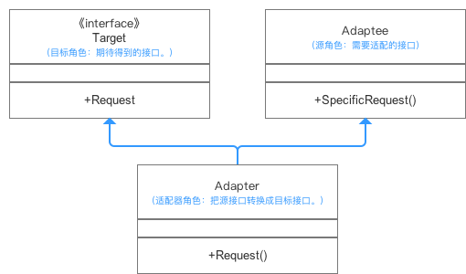
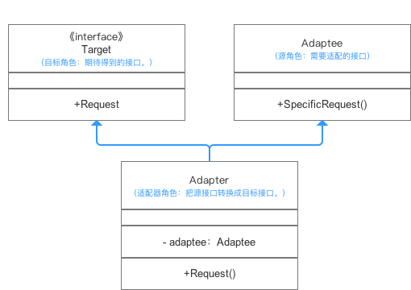

# 五、物理系统与碰撞

## 改进飞碟（Hit UFO）游戏：

- 游戏内容要求：
  1. 按 *adapter模式* 设计图修改飞碟游戏
  2. 使它同时支持物理运动与运动学（变换）运动

## adapter模式

> 参考：https://blog.csdn.net/carson_ho/article/details/54910430

### 1.类的适配器模式

> 适配器模式，即定义一个包装类，用于包装不兼容接口的对象
>
> 包装类 = 适配器Adapter；
>
> 被包装对象 = 适配者Adaptee = 被适配的类



- 冲突：Target期待调用Request方法，而Adaptee并没有（这就是所谓的不兼容了）。
- 解决方案：为使Target能够使用Adaptee类里的SpecificRequest方法，故提供一个中间环节Adapter类**（继承Adaptee & 实现Target接口）**，把Adaptee的API与Target的API衔接起来（适配）。


**步骤1：** 创建**Target接口（期待得到的插头）**：能输出110V（将220V转换成110V）

```c#
 public interface Target {

    //将220V转换输出110V（原有插头（Adaptee）没有的）
    public void Convert_110v();
}
```

**步骤2：** 创建源类（原有的插头） ；

```c#
class PowerPort220V{
//原有插头只能输出220V
    public void Output_220v(){
    }
}
```

**步骤3： **创建适配器类（Adapter）

```c#
class Adapter220V extends PowerPort220V implements Target{
   //期待的插头要求调用Convert_110v()，但原有插头没有
    //因此适配器补充上这个方法名
    //但实际上Convert_110v()只是调用原有插头的Output_220v()方法的内容
    //所以适配器只是将Output_220v()作了一层封装，封装成Target可以调用的Convert_110v()而已

    @Override
    public void Convert_110v(){
      this.Output_220v;
    }
}
```

**步骤4： **定义具体使用目标类，并通过Adapter类调用所需要的方法从而实现目标（不需要通过原有插头）

```c#
//进口机器类
class ImportedMachine {

    @Override
    public void Work() {
        System.out.println("进口机器正常运行");
    }
}


//通过Adapter类从而调用所需要的方法
public class AdapterPattern {
    public static void main(String[] args){

        Target mAdapter220V = new Adapter220V();
        ImportedMachine mImportedMachine = new ImportedMachine();

        //用户拿着进口机器插上适配器（调用Convert_110v()方法）
        //再将适配器插上原有插头（Convert_110v()方法内部调用Output_220v()方法输出220V）
        //适配器只是个外壳，对外提供110V，但本质还是220V进行供电
        mAdapter220V.Convert_110v();
        mImportedMachine.Work();
    }
}
```

#### 2.对象的适配器模式

> 与类的适配器模式不同的是，对象的适配器模式不是使用继承关系连接到Adaptee类，而是使用委派关系连接到Adaptee类。



- 冲突：Target期待调用Request方法，而Adaptee并没有（这就是所谓的不兼容了）。
- 解决方案：为使Target能够使用Adaptee类里的SpecificRequest方法，故提供一个中间环节Adapter类**（包装了一个Adaptee的实例）**，把Adaptee的API与Target的API衔接起来（适配）。

**步骤1：** 创建**Target接口**；

```c#
public interface Target {

    //这是源类Adapteee没有的方法
    public void Request(); 
}
```

**步骤2：** 创建**源类（Adaptee）** ；

```c#
public class Adaptee {

    public void SpecificRequest(){
    }
}
```

**步骤3：** 创建**适配器类（Adapter）**（不适用继承而是委派）

```c#
class Adapter implements Target{  
    // 直接关联被适配类  
    private Adaptee adaptee;  

    // 可以通过构造函数传入具体需要适配的被适配类对象  
    public Adapter (Adaptee adaptee) {  
        this.adaptee = adaptee;  
    }  

    @Override
    public void Request() {  
        // 这里是使用委托的方式完成特殊功能  
        this.adaptee.SpecificRequest();  
    }  
}  
```

**步骤4： **定义具体使用目标类，并通过Adapter类调用所需要的方法从而实现目标

```c#
public class AdapterPattern {
    public static void main(String[] args){
        //需要先创建一个被适配类的对象作为参数  
        Target mAdapter = new Adapter(new Adaptee())；
        mAdapter.Request();

    }
}
```


## 同时支持物理运动与运动学（变换）运动的改进版本


在UserGUI中添加选择按钮，并在场记中添加记录游戏模式的变量。根据选择执行不同的动作管理器，一种是支持物理引擎的PhsicActionManager（PHYSICS），一种是之前的简单动作管理器（MOTION）。


## 部分修改代码：

### 1.场记

两个动作管理器实现IACtionManager的接口。

```c#
public enum ActionMode { PHYSIC, KINEMATIC, NOTSET }  

public IActionManager actionManager { get; set; }  //动作管理器

public ActionMode mode { get; set; }

//根据选择添加不同的场记
public void setMode(ActionMode am){
		if (am == ActionMode.KINEMATIC)  {  
			this.gameObject.AddComponent<SSActionManager>();  
		}  
		else  {  
			this.gameObject.AddComponent<PhysisActionManager>();  
		}  
		mode = am;
	}
```


### 2.IActionManager的接口：

```java
public interface IActionManager {  
	void StartThrow(GameObject disk);  
	int getDiskNumber();  
	void setDiskNumber(int num);  
}  
```


### 3.CCMoveToActions的改进：

添加FixedUpdate实现物理效果

```c#
public override void Start () {  
		enable = true;  
		gravity = 9.8f;  
		time = 0;  
		horizonSpeed = gameobject.GetComponent<DiskData>().speed;  
		direction = gameobject.GetComponent<DiskData>().direction;  
		rigidbody = this.gameobject.GetComponent<Rigidbody> ();

		//如果使用了物理模式的刚体，则设置。
		if (rigidbody) {
			rigidbody.velocity = horizonSpeed * direction;
		}
	}  

//物理模式下的运动
public override void FixedUpdate(){
		if (gameobject.activeSelf) {
			if (this.transform.position.y < -3) {
				this.destory = true;
				this.enable = false;
				this.callback.SSActionEvent (this);
			}
		}
	}
```


## 物理效果图：

