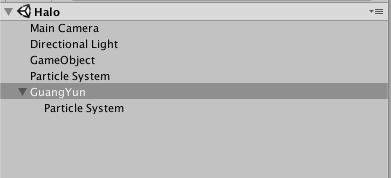

# 七、粒子系统

> 参考博客：https://16sixteen.github.io/unity3d/unity3d_particle_ring
>
> 参考资源：https://www.cnblogs.com/CaomaoUnity3d/p/5983730.html

游戏效果图：


游戏视频地址：

完成内容：

1. 建立光晕粒子系统，掌握粒子系统的一些基本组件。
2. 参考 http://i-remember.fr/en 这类网站，使用粒子流编程控制制作一些效果， 如“粒子光环”。


## 粒子系统的属性：

| 属性名                       | 含义                                                         |
| ---------------------------- | ------------------------------------------------------------ |
| Duration                     | 粒子系统的发射周期                                           |
| Looping                      | 是否要循环发射                                               |
| Prewarm                      | 预热(基本不用)                                               |
| Start Delay                  | 发射延迟(等多长时间后开始发射)                               |
| Start Lifetime               | 单个粒子的生命周期                                           |
| Start Speed                  | 粒子的初始速度(后面与粒子生命周期一样有个小三角，基本功能都一样) |
| Start Size                   | 粒子的初始大小(后面与粒子生命周期一样有个小三角，基本功能都一样) |
| 3D Start Rotation            | 初始粒子的3维旋转                                            |
| Start Rotation               | 初始粒子的二维旋转                                           |
| Randomize Rotation Direction | 随机一个旋转方向(取值在0~1)                                  |
| Random Between Two Colors    | 在俩种颜色种随机                                             |
| Random Between Two Gradients | 在俩种渐变色之间随机                                         |
| Gravity Modifier             | 粒子受到的重力系数                                           |
| Simulation Space             | 粒子坐标系                                                   |
| Hierarchy                    | 层级缩放，父物体的缩放会影响到粒子系统粒子的缩放             |
| Local                        | 粒子缩放只受粒子系统自己的Scale属性缩放影响                  |
| Shape                        | 粒子不受任何缩放影响                                         |
| Max Particles                | 对这个粒子系统来说，允许存在的最大粒子数                     |
| Play On Awake                | 是否在唤醒时播放                                             |

Emission：粒子发射模块


Rate：粒子的发射速率

速率下一行是选择发射速率是根据时间还是距离变化(即每秒还是每米，如果选择了根据距离变化，此时Simulation Space为Local则不会发射粒子，应为本地坐标系距离不变，如果是World才会发射)

Bursts：爆发(粒子在某一时刻发射多少粒子)

可以设置粒子发射器在Time时刻，发射最小Min。最大Max的粒子数

\----------------------------------------------------------------------------------------------------------------------------------------------------------

Shape：发生器形状模块


shape：形状(默认是Cone圆锥体，还有球体等其它形状)

Angle：圆锥体的角度(角度为0时成为柱体)

Radius：圆锥体圆半径

Length：锥体长度(如果Emit from属性设置为Base则长度是灰色不可设置的，此时锥体长度受粒子速度的影响，如果为Volume时则可以设置)

Emit from ：粒子发射的位置


Base：从底部随机点发射

Base Shell：从底部的圆边向上随机点发射

Volume：在锥体内部圆底上方随机点发射

Volume Shell：从底部圆边上方延锥面随机点发射

\----------------------------------------------------------------------------------------------------------------------------------------------------------

Velocity over LifeTime：粒子生命周期中速度模块


可设置粒子在，x,y,z轴的速度

Space：坐标系(Local代表速度是按自身的坐标系，World是代表速度按世界坐标系)

\----------------------------------------------------------------------------------------------------------------------------------------------------------

Limit Velocity over LifeTime：限制粒子生命周期中速度模块


Separate Axes：是否限制轴的速度

Speed：粒子的发射速度

Dampen：阻尼(取值在0~1)

\----------------------------------------------------------------------------------------------------------------------------------------------------------

Force over LifeTime：粒子在生命周期中受力模块


用于设置粒子在x,y,z轴的力

Space：坐标系

力是有加速度的，所以粒子的速度不同于Velocity over LifeTime模块速度固定，而是变化的，所以可用于模拟风

\----------------------------------------------------------------------------------------------------------------------------------------------------------

Color over LifeTime：粒子生命周期中的颜色模块


用于设置粒子在正个生命周期中颜色的变化，基本操作与Start Color一样

\----------------------------------------------------------------------------------------------------------------------------------------------------------

Color by Speed：粒子颜色随速度变化模块


Color：设置颜色

SpeedRange：速度的取值范围(在这个区间里的速度分别对应上面的颜色)

\----------------------------------------------------------------------------------------------------------------------------------------------------------

Size over Lifetime：粒子生命周期中的大小模块(基本操作与颜色一样)

Size by Speed：粒子大小随速度的变化模块(基本操作与颜色一样)

Rotation over Lifetime：粒子生命周期中的旋转模块(基本操作与颜色一样)

Rotation by Speed：粒子的旋转随速度的变化模块(基本操作与颜色一样)

Inherit Velocity：继承速度(基本不用)

External Forces：外部作用力模块(可控制风域的倍增系数)

\----------------------------------------------------------------------------------------------------------------------------------------------------------

Collision：粒子碰撞模块


Planes：跟平面碰撞

World：跟世界里的物体碰撞

现在以平面碰撞介绍：

点击右边的+号按钮可添加一个Plane碰撞体，在Hierarchy视图中粒子系统的子物体中出现

Visualization：选择碰撞体出现的形式

Grid：Scene视图中可以看到网格，Game视图中啥也没有

Solid：Scene和Game视图都会看到一个平面

Scale Plane：碰撞体的大小

Visualize Bounds：是否显示粒子的碰撞体

Dampen：阻尼(取值0~1，位1时，粒子被吸附在碰撞体面上)

Bounce：弹力系数

LifeTime Loss：碰撞后粒子损失多少生命时间

Min Kill Speed：粒子碰撞损失多少速度

Radius Scale：碰撞偏移(值越大，粒子与碰撞体发生碰撞的点越远离碰撞体)

Send Collision Message：是否发送碰撞事件

\----------------------------------------------------------------------------------------------------------------------------------------------------------

Sub Emitters：子发射模块


用于设置粒子生命过程中是否产生行的发射器

点击右面+号便可以新建粒子发射器，在Hierarchy视图中粒子系统的子物体中出现，可以想一个新的粒子系统一样去编辑。点击圆圈可选择已创建好的粒子系统。

Birth：粒子出生时产生新的粒子系统

Collision：粒子发生碰撞时产生新的粒子系统

Death：粒子死亡时产生新的粒子系统

\----------------------------------------------------------------------------------------------------------------------------------------------------------

Texture Sheet Animation：贴图UV动画模块


Tiles：将贴图划分为几行几列(把特效做在了一张图片上,需要在Renderer模块中指定材质)

Animation：动画模式(Whole Sheet是整张图片，它会从左到右，从上到下播放；Single Row 选择某一行播放)

Frame over Time：用于指定动画的帧是如何随着时间的推移增加

Cycles：动画在粒子的生命周期中的播放次数

\----------------------------------------------------------------------------------------------------------------------------------------------------------

Renderer:渲染模块


Render Mode：渲染图像模式(Billboard无论相机怎么旋转，粒子总是面对着相机；Stretched Billboard面对相机会缩放；Horizontal Billboard粒子平面平行于XZ平面；**Vertical Billboard**粒子在世界Y轴是正直的,面对镜头；**Mesh**粒子呈现3 d网格而不是纹理)

Normal Direction：**照明法线用于粒子图像**

**Material：特效贴图材质**

**Sort Model：渲染顺序(**By Distance根据距离渲染，Oldest in Front 已经发射的先渲染，Youngest in Front，新发射的先渲染**)**

**Sorting Fudge：**值越小越后绘制

Cast Shadows：是否开启阴影

Receive Shadows：是否接受阴影

Min Particle Size：最小粒子的渲染大小

MaxParticle Size：最大粒子的渲染大小

Sorting Layer：渲染的层

Order in Layer：同一层的渲染顺序(值越大越后被渲染)

Billboard Alignment：广告牌对齐

Pivot：粒子的轴心点

在Start Lifetime属性后面有个小三角，点击后出现如下这个图


Constant：固定常数，所以生成的粒子的生命周期都是这个数

Curve：曲线周期


粒子的生命周期随曲线变化

Random Between Two Constants：在俩个常数间取值

Random Between Two Curves：在俩个曲线间取值


\----------------------------------------------------------------------------------------------------------------------------------------------------------

Start Color：粒子初始颜色

在Start Color后面的小三角，点击后


Color：固定一种颜色

Gradient：渐变色


最左端下方的子弹形状对应粒子的开始颜色，最右端下方的对应粒子的结束颜色，中间的为过渡点，上方的子弹形状的点代表透明度，颜色加透明度共同作用，达到粒子在生命周期中颜色的变化(注意，过渡点最多8个，鼠标点击上方或下方自动创建，delete键删除)


## 光晕粒子系统

光晕粒子系统有两个粒子系统构成，根据以上属性，下载提供资源，将光源粒子系统作为光圈粒子系统的父节点。



父节点属性值：


子节点属性值：


## 粒子光环

每个粒子包含四个属性，在极坐标中的极角，轨道半径长度，游离时间（每帧的秒数）和透明度。

设置光环理论上的最大半径和最小半径，以及粒子发射的速度和大小。

最后将所有粒子分成三部分（level）。


```c#
public ParticleSystem particleSystem;
private ParticleSystem.Particle[] particleRing;//粒子工厂

private float[] particleAngle;//每个粒子的角度
private float[] particleR;//每个粒子的半径
private float[] particleTime;//每个粒子的游离时间
public Gradient gradient;  //每个粒子的透明度

public int particleNum = 10000;//粒子数量
public float minRadius = 5.0f;//粒子轨道最小半径
public float maxRadius = 10.0f;//粒子轨道最大半径
public int level = 3;//子部分的数量
public float speed = 0.02f;
public float size = 0.10f;
public float pingPong = 0.02f;
```


初始化传入粒子系统

```c#
particleRing = new ParticleSystem.Particle[particleNum];
particleSystem.startSize = size;          // 设置粒子大小  
particleSystem.maxParticles = particleNum;
particleSystem.Emit(particleNum);
particleSystem.GetParticles(particleRing);
```

初始化粒子位置，并保存粒子的四个属性值。

```c#
for (int i = 0; i < particleNum; i++) {
			float midR = (maxRadius + minRadius)/2;
			float rate1 = Random.Range(1.0f, midR / minRadius); //最小半径随机扩大
			float rate2 = Random.Range(midR / maxRadius, 1.0f); //最大半径随机缩小
			float r = Random.Range(minRadius*rate1, maxRadius*rate2);

			float angle = Random.Range(0.0f, 360.0f);
			float time = Random.Range(0.0f, 360.0f);
			particleAngle[i] = angle;
			particleR[i] = r;
			particleTime[i] = time;

			float theta = angle / 180 * Mathf.PI;
			particleRing[i].position = new Vector3(r * Mathf.Cos(theta), 0.0f, r * Mathf.Sin(theta));
		}
		particleSystem.SetParticles(particleRing,particleNum);
```


三个部分分别以不同方向旋转粒子，使用pingpong函数在一定范围内改变粒子轨道半径的大小，并修改透明度大小。

```c#
void Update () {
		for(int i = 0;i < particleNum; i++) {
			//设置为level=5部分的粒子，能被2整除的部分逆时针旋转，否则顺时针
			if (i%2 == 0) {
				//逆时针旋转
				particleAngle[i] += (i % level) * speed;
			} else {
				//顺时针旋转
				particleAngle[i] -= (i % level) * speed;
			}
			//透明度变化
			particleRing[i].color = gradient.Evaluate(particleAngle[i] / 360.0f);  
			//半径变化
			particleTime[i] += Time.deltaTime;  
			particleR[i] += Mathf.PingPong(particleTime[i] / minRadius / maxRadius, pingPong) - pingPong / 2.0f;  
			//角度：0-359
			particleAngle[i] = particleAngle[i] % 360;
			float theta = particleAngle[i] / 180 * Mathf.PI;
			//根据正弦余弦公式设置粒子位置
			particleRing[i].position = new Vector3(particleR[i] * Mathf.Cos(theta),  0.0f,particleR[i] * Mathf.Sin(theta));
		}
		particleSystem.SetParticles(particleRing, particleNum);
	}
```


建立empty gameobject，挂载脚本然后建立一个粒子系统并挂载到此脚本中。