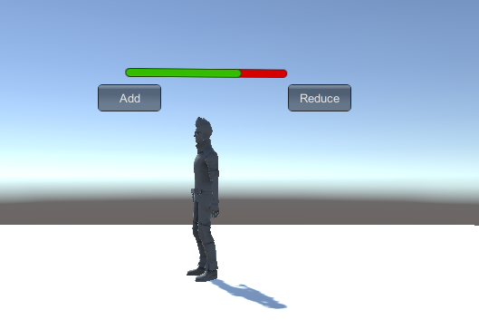
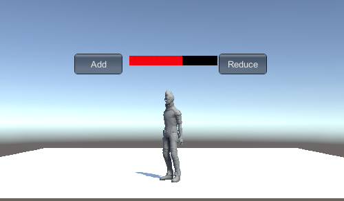
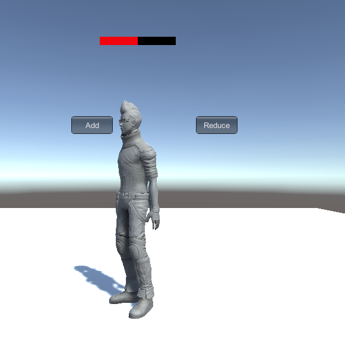

# 第八章、UI系统

## 1、作业与练习

血条（Health Bar）的预制设计。具体要求如下

- 分别使用 IMGUI 和 UGUI 实现
- 使用 UGUI，血条是游戏对象的一个子元素，任何时候需要面对主摄像机
- 分析两种实现的优缺点
- 给出预制的使用方法

### 博客地址：

https://hansenbeast.github.io/post/2018-06-04-unity3d-lecture-8/

### 效果视频地址：

https://pan.baidu.com/s/1XzbEqBXio-K-QhGLLWWPTA

**场景HP Bar为UGUI实现，HP Bar2为IMGUI实现。**

### 效果图：

UGUI：



IMGUI：



### 设计思路：

> 参考博客：https://www.cnblogs.com/vmoor2016/p/6044941.html

#### 1、UGUI

根据课上的实验，在游戏模型下添加Canvas并添加Slide为其子对象。设置画布大小为160*20米，而其中的每个UI元素的大小缩小100倍（scale=0.01x0.01)。

- BackGround,实际上是一个GameObject,携带Canvas Renderer这是一个其他渲染器都渲染完毕之后最后使用的渲染器，可以在脚本中调用其含有的参数和方法


- Fill Area,一个空的Rect Transform父物体，下面一个有Canvas Renderer和Image的父物体，主要也是一个区域和图片 默认Slider是个小圆


- Handler Slider Area,类似Fill Area，默认Slider是个大圆，可以移动位置看其中的fillArea，可以看出其将图片拉长了，这就应该是所谓的填充。**如果把Handle删除，会发现进度条永远走不到最大,这是由于Fill Area中的Fill的大小比背景图上的条小，最后一段到达不了，而Handle存在时是一个大圆可以覆盖到最远端。**

[<a href="#Canvas的三种渲染模式比较：">Canvas的三种渲染模式比较</a>](#jump)

设置fill的Image Color为绿色，代表生命值，Background的Image Color为红色，代表失去的生命值，将整个Slide按照z轴旋转180度，保证血条从右往左减少。

**第一种方法：**

改变Slide中RectTransform的Right大小。

挂载UGUI.cs脚本：

```c#
using System.Collections;
using System.Collections.Generic;
using UnityEngine;

public class UGUI : MonoBehaviour {

	public RectTransform bgBar;
	public RectTransform bloodBar;
	public int HP = 0;
	void Update()
	{
        //保证任何时候需要面对主摄像机
		this.transform.LookAt (Camera.main.transform.position);
        //改变fill的RectTransform中Right的大小，需要添加静态类扩展Right方法。
		bloodBar.GetComponent<RectTransform>().Right(HP);
	}
	
    //添加两个button分别改变HP的值
	private void OnGUI()
	{
		if (GUI.Button (new Rect (Screen.width/2-140, Screen.height/2-100, 70, 30), "Add")) {
			HP -= 10;
			if (HP < 0) {
				HP = 0;
			}
		}
		if (GUI.Button (new Rect (Screen.width/2+70, Screen.height/2-100,70, 30), "Reduce")) {
			HP += 10;
			if (HP > 200) {
				HP = 200;
			}
		}
	}
}
```

添加静态类扩展方法Extendsion.cs:

```c#
using UnityEngine;

// 必须是静态类才可以添加扩展方法
public static class ExtendsionMethod
{
	// 扩展方法必须是静态的
	// this 必须有，RectTransform表示我要扩展的类型，rTrans表示对象名
	// 如果要带参数就在后面带上
	public static void Left(this RectTransform rTrans, int value)
	{
		rTrans.offsetMin = new Vector2(value, rTrans.offsetMin.y);
	}

	public static void Right(this RectTransform rTrans, int value)
	{
		rTrans.offsetMax = new Vector2(-value, rTrans.offsetMax.y);
	}

	public static void Bottom(this RectTransform rTrans, int value)
	{
		rTrans.offsetMin = new Vector2(rTrans.offsetMin.x, value);
	}

	public static void Top(this RectTransform rTrans, int value)
	{
		rTrans.offsetMax = new Vector2(rTrans.offsetMax.x, -value);
	}
}
```

**第二种方法：**

直接改变Slide中的value。

UGUI2.cs

```c#
using UnityEngine;
using System.Collections;
using System.Collections.Generic;
using UnityEngine.UI; //注意添加UI命名空间

public class UGUI2 : MonoBehaviour {

	public Slider HPStrip;    //添加血条Slider的引用
    public int HP;

	void Start () {
		HPStrip.value = HPStrip.maxValue = HP;    // 初始化血条
	}
    void Update(){
        //保证任何时候需要面对主摄像机
		this.transform.LookAt (Camera.main.transform.position);
    }

	void OnGUI(){
		if (GUI.Button (new Rect (Screen.width / 2 - 140, Screen.height / 2 - 100, 70, 30), "Add")) {
			HP += 10;
			if (HP < 0) {
				HP = 0;
			}
			HPStrip.value = HP;    //适当的时候对血条执行操作
		}
		if (GUI.Button (new Rect (Screen.width / 2 + 70, Screen.height / 2 - 100, 70, 30), "Reduce")) {
			HP -= 10;
			if (HP > 200) {
				HP = 200;
			}
			HPStrip.value = HP;    //适当的时候对血条执行操作
		}
	}
}
```


#### 2、IMGUI：

将3D的人物坐标换算成2D平面中的坐标，继而找到人物头顶在屏幕中的2D坐标最后使用GUI将名称与血条绘制出来。

IMGUI.cs

```c#
using UnityEngine;
using System.Collections;

public class IMGUI : MonoBehaviour {

	//主摄像机对象
	private Camera camera;
	//人物对象
	public GameObject hero;
    //人物高度
	float npcHeight;
	//红色血条贴图
	public Texture2D blood_red;
	//黑色血条贴图
	public Texture2D blood_black;
	//默认血值
	private float HP = 100;

	void Start ()
	{
		hero = GameObject.FindGameObjectWithTag("Ethan");
		camera = Camera.main;
		npcHeight = 2;
	}

	void Update ()
	{	
        //保证任何时候需要面对主摄像机
		transform.LookAt(hero.transform);
	}

	void OnGUI()
	{
		if (GUI.Button(new Rect (Screen.width/2-140, Screen.height/2-100, 70, 30), "Add"))
		{
			HP += 5f;
		}
		if (GUI.Button(new Rect(Screen.width/2+70, Screen.height/2-100,70, 30), "Reduce"))
		{
			HP -= 5f;
		}
		if (HP > 100f)
		{
			HP = 100f;
		}
		if (HP < 0.0f)
		{
			HP = 0.0f;
		}
		//3d坐标
		Vector3 worldPosition = new Vector3 (transform.position.x , transform.position.y + npcHeight,transform.position.z);
		//3D坐标换算成它在2D屏幕中的坐标
		Vector2 position = camera.WorldToScreenPoint (worldPosition);
		//人物真实NPC头顶的2D坐标
		position = new Vector2 (position.x, Screen.height - position.y);
		//根据贴图大小计算出初始血条的宽高
		Vector2 bloodSize = GUI.skin.label.CalcSize (new GUIContent(blood_red));
		//通过血值计算红色血条显示区域
		float blood_width = blood_red.width * HP/100;
		//先绘制黑色血条
		GUI.DrawTexture(new Rect(position.x - (bloodSize.x/2),position.y - bloodSize.y ,bloodSize.x,bloodSize.y),blood_black);
		//再绘制红色血条
		GUI.DrawTexture(new Rect(position.x - (bloodSize.x/2),position.y - bloodSize.y ,blood_width,bloodSize.y),blood_red);

	}
```



#### 分析两种实现的优缺点：

1. IMGUI：

   **优点：**避免了 UI 元素保持在屏幕最前端。

   按 Unity 官方说法，IMGUI 主要用于以下场景：

   - 在游戏中创建调试显示工具
   - 为脚本组件创建自定义的 Inspector 面板。
   - 创建新的编辑器窗口和工具来扩展 Unity 环境。

   **缺点：**血条在2d坐标中，不会随着人物转动而跟着转动。IMGUI系统通常不打算用于玩家可能使用并与之交互的普通游戏内用户界面。为此，应该使用 Unity 的基于 GameObject 的 UGUI 系统。

2、UGUI：

**优点：**血条在3d坐标中，会随着人物转动而跟着转动。

- 跨设备执行，自动适应不同分辨率
- UI 元素与游戏场景融为一体的交互
- 复杂的布局
- 多摄像机支持
- 所见即所得（WYSIWYG）设计工具
- 支持多模式、多摄像机渲染
- 面向对象的编程


### Canvas的三种渲染模式比较：

1. Screen Space-Overlay模式

　　Screen Space-Overlay（屏幕控件-覆盖模式）的画布会填满整个屏幕空间，并将画布下面的所有的UI元素置于屏幕的最上层，或者说画布的画面永远“覆盖”其他普通的3D画面，如果屏幕尺寸被改变，画布将自动改变尺寸来匹配屏幕，如下图效果：

　                                                                    

​		（在此模式下，虽然在Canvas前放置了3D人物，但是在Game窗口中并不能观察到3D人物）

Screen Space-Overlay模式的画布有Pixel Perfect和Sort Layer两个参数：

（1）Pixel Perfect：只有RenderMode为Screen类型时才有的选项。使UI元素像素对应，效果就是边缘清晰不模糊。

（2）Sort Layer: Sort Layer是UGUI专用的设置，用来指示画布的深度。


1. Screen Space-Camera模式

　　Screen Space-Camera（屏幕空间-摄影机模式）和Screen Space-Overlay模式类似，画布也是填满整个屏幕空间，如果屏幕尺寸改变，画布也会自动改变尺寸来匹配屏幕。所不同的是，在该模式下，画布会被放置到摄影机前方。在这种渲染模式下，画布看起来 绘制在一个与摄影机固定距离的平面上。所有的UI元素都由该摄影机渲染，因此摄影机的设置会影响到UI画面。在此模式下，UI元素是由perspective也就是视角设定的，视角广度由Filed of View设置。

　　这种模式可以用来实现在UI上显示3D模型的需求，比如很多MMO游戏中的查看人物装备的界面，可能屏幕的左侧有一个运动的3D人物，左侧是一些UI元素。通过设置Screen Space-Camera模式就可以实现上述的需求，效果如下图所示：

　　                                                                                     

　　它比Screen Space-Overlay模式的画布多了下面几个参数：

　　（1）Render Camera:渲染摄像机

　　（2）Plane Distance:画布距离摄像机的距离

　　（3）Sorting Layer: Sorting Layer是UGUI专用的设置，用来指示画布的深度。可以通过点击该栏的选项，在下拉菜单中点击“Add Sorting Layer”按钮进入标签和层的设置界面，或者点击导航菜单->edit->Project Settings->Tags and Layers进入该页面。

　　　　可以点击“+”添加Layer，或者点击“-”删除Layer。画布所使用的Sorting Layer越排在下面，显示的优先级也就越高。

　　（4）Order in Layer:在相同的Sort Layer下的画布显示先后顺序。数字越高，显示的优先级也就越高。

　　

1. World Space

　　World Space即世界控件模式。在此模式下，画布被视为与场景中其他普通游戏对象性质相同的类似于一张面片（Plane）的游戏物体。画布的尺寸可以通过RectTransform设置，所有的UI元素可能位于普通3D物体的前面或者后面显示。当UI为场景的一部分时，可以使用这个模式。

　　它有一个单独的参数Event Camera，用来指定接受事件的摄像机，可以通过画布上的GraphicRaycaster组件发射射线产生事件。

　　这种模式可以用来实现跟随人物移动的血条或者名称，如下图所示：

　                                                                         　

　　我们通过下面的表格可以对比一下三种渲染模式的区别：

| 渲染模式             | 画布对应屏幕 | 摄像机 | 像素对应 | 适合类型 |
| -------------------- | ------------ | ------ | -------- | -------- |
| Screen Space-Overlay | 是           | 不需要 | 可选     | 2D UI    |
| Screen Space-Camera  | 是           | 需要   | 可选     | 2D UI    |
| World Space          | 否           | 需要   | 不可选   | 3D UI    |

## 2、附录：Unity UI 技术概述

> 转自：https://pmlpml.github.io/unity3d-learning/09-ui.html#6%E4%BD%9C%E4%B8%9A%E4%B8%8E%E7%BB%83%E4%B9%A0

Unity 目前支持两套完全不同风格的 UI 系统：

- IMGUI（Immediate Mode GUI）：及时模式图形界面。它是代码驱动的 UI 系统，即没有图形化设计界面，只能在 OnGUI 阶段用 GUI 系列的类绘制各种 UI 元素。
- Unity GUI / UGUI 是面向对象的 UI 系统。所有 UI 元素都是游戏对象，有友好的图形化设计界面， 在场景渲染阶段渲染这些 UI 元素。

### UGUI 基础

#### 一、画布

画布（Cavas）是绘图区域, 同时是 ui 元素的容器。 容器中 ui 元素及其子 UI 元素都将绘制在其上。 拥有Canvas组件的游戏对象都有一个画布，它空间中的子对象，如果是 UI 元素将渲染在画布上。

画布区域在场景视图中显示为矩形。这使得定位UI元素变得非常容易，无需随时显示游戏运行视图。

**1、UI元素的显示顺序**

画布中的UI元素按照它们在层次结构中出现的顺序绘制。如果两个UI元素重叠，后面的元素将出现在较早的元素之上。因此，最后一个孩子显示在最上面。

要更改哪些元素出现在其他元素的顶部，通过拖动它们在 Hierarchy 视图中的位置。这顺序也可以通过 Transform 组件的方法在脚本中控制。 如：SetAsFirstSibling，SetAsLastSibling 和SetSiblingIndex。

**2、渲染模式**

画布组件有渲染模式（Render Mode）设置，可用于使其在屏幕空间（Screen Space2D）或世界空间（World Space3D）中渲染。

 UI元素采用像素单位表示位置和尺寸， UI元素默认在 UI 层

**屏幕空间 - 叠加（Screen Space - Overlay）**

将UI元素放置在场景顶部渲染的屏幕，画布会自动更改大小匹配屏幕。Canvas 默认中心点为屏幕中心！


**屏幕空间 - 相机（Screen Space - Camera）**

画布放在制定的渲染摄像机前，如 100 的位置，画布会自动匹配为屏幕分辨率。Canvas 默认中心点为屏幕中心！ 

**世界空间（World Space）**

画布行为与场景中的其他任何对象一样，UI元素将放置在其他对象的前面或后面渲染。**画布大小和位置任意设置**，这对于意在成为世界一部分的用户界面非常有用。


**3、测试渲染模式**

 操作 09-01，渲染模式练习：

- 菜单 GameObject -> UI -> Button

在游戏对象层次视图中出现 Canvas 和 EventSystem。

- 展开 Canvas 看到 Buttion
- 展开 Button 看到 Text
- 菜单 GameObject -> 3D Object -> Cube 添加 Cube 作为参考物
- 检查、设置以下对象属性
  - Main Camera 的 Position = （0，1，-10）
  - Canvas::Button 的 （PosX,PosY,PosZ） = (0,0,0)
  - Cube 的 Position = （0，**0.5**，0）
- 使用鼠标中间滚轮在场景视图中缩小，直到看到整个画布，中间有一个 Button

研究渲染模式：

- 选择 Canvas 对象的 Inspector 面板中 Canvas 组件
  - 设置 Render Mode 为 Screen Space - Overlay

在 Game 视图中，看到按钮覆盖在 Cube 上。

- 选择 Canvas 对象的 Inspector 面板中 Canvas 组件
  - 设置 Render Mode 为 Screen Space - Camera
  - 设置 Render Camera 为 Main Camera

结果在 Game 视图中，看到按钮在 Cube 后面。

- 选择 Main Camera
  - 在 Camera 组件面板中修改 Field of View

在 Game 视图中，Cube 变化大小，而按钮保持不变。

- 切换到 Scene 视图
- 在 Camera 组件面板中修改 Field of View

观察到画布随着视口自动改变大小。

 Cube 变化大小，按钮保持不变。 为什么？

#### 二、UI 布局基础

每个UI元素都被表示为一个矩形，为了相对于 Canvas 和 其他 UI 元素实现定位，Unity 在 Transform 基础上定义了 RectTransform （矩形变换） 支持矩形元素在 2/3D 场景中变换。

**1、矩形变换**

矩形变换像常规变换一样具有位置，旋转和比例，但它也具有宽度和高度表示矩形的尺寸。


 矩形位置和尺寸请使用像素，以匹配素材！

以下是矩形变换的重要概念：

**Pivot/旋转点/轴心**：旋转点在场景视图中显示为蓝色圆圈。用规范化坐标表示位置，如 （0.5,0.5）表示矩形的中心。


修改 Rotation 属性，矩形围绕此点旋转。

**Anchors/锚点**：锚点在场景视图中显示为四个小三角形手柄（四叶花）。每个叶子位置对应矩形的四个顶点。当描点随父对象变换时，矩形的顶点与对应的锚点**相对位置必须保持不变**。

 操作 09-02 ，锚点练习：

- 将场景视图设为 2D 模式
- 使用鼠标中间滚轮在场景视图中缩小，直到看到整个画布，中间有一个 Button
- 将 Canvas 的 Reader 设为 World Space，以便改变父对象（画布）的大小


UI元素锚定到父项的中心。该元素保持到中心的固定偏移量。


UI元素锚定在父级的右下角。该元素保持右下角的固定偏移量。


左侧角落的UI元素锚定在父代的左下角，右侧角落锚定在右下角。元素的角落保持固定的偏移到他们各自的锚点。


具有左角的UI元素锚定到距离父元素左侧一定百分比的点，右角点锚定到距父矩形右侧一定百分比的点。

 如何实现父元素与子元素等比缩放？

**2、矩形工具**

Unity 在界面上提供了工具以方便修改 UI 元素的变换参数。


提供了移动、旋转、比例、矩形四个工具。该图选择了矩形工具的工具栏按钮


在选择矩形工具时，设置为“旋转”和“局部”视图，通常便于操作

**3、锚点预设**

在 Inspector 面板中，可以在 Rect Transform 组件的左上角找到 Anchor Preset 按钮。点击该按钮会弹出 Anchor Presets 下拉菜单。


#### 三、 UI 组件与元素

UI 部件都是用 Script 开发的自定义组件。包括在 UI、Layout 和 Rendering 等分类中。

**1、可视化组件**

[可视化组件](https://docs.unity3d.com/Manual/UIVisualComponents.html)，在组件 UI 分类中，包括：

- Text：显示的文本的文本区域。可以设置字体，字体样式，字体大小以及文本是否具有丰富的文本功能。
- Image：显示图片的区域。可以设置**GUI精灵**、色彩。
- Raw Image：原始图像采用纹理，进行 UV 矩形贴图。
- Mask：Mask不是一个可见的UI控件。遮罩将子元素限制（即“掩蔽”）为父元素的形状。如果孩子比父控件大，那么只有适合父节点遮罩的部分是可见的。
- Effects：应用各种简单的效果，例如简单的投影或轮廓。

**2、UI 交互元素**

UI 交互元素是 GameObject，它拥有 UI 交互组件、UI可视化组件、及相关组件的组合，以及一些 UI 子元素构成，以方便用户在设计场景中创建交互界面。

例如：Button 元素，除了 UI 必须拥有的 RectTransform 和 Canvas renderer 外，还有 Image 和 Button 组件，以及一个 Text 子元素。

- Button
- Toggle
- Toggle Group
- Slider
- Scrollbar
- Dropdown
- Input Field
- Scroll Rect (Scroll View)

详细信息，参见官方 [UI 元素](https://docs.unity3d.com/Manual/UIInteractionComponents.html)

### 四、圆形遮罩、动画、富文本、血条

圆形遮罩、动画、富文本、血条等都是菜单制作，初步理解 Text，Image，RowImage，Mask 等的基本使用技巧。

**1、圆形遮罩**

准备一个可爱动物卡通头像，例如：

任务是使用 Mask 遮罩制作圆形头像

 操作 09-03 ，Mask 练习：

- 准备一个新项目
- 将 png 图片拖入 assets 视图，作为 texture
- 层次视图 context 菜单 -> UI -> Panel 创建 Panel
- 在 Panel 下添加 RawImage 元素
- 将图片拖入 RawImage 的 Texture 插槽
- 场景选择 2D 视图，并缩放至看到整个画布
- 选择 Panel 对象
  - 在 RectTansform 组件选择预制描点 （middle，center）
  - 用 Rect 工具，将 Panel 与图片大小一致
  - 添加 Mask 组件
  - 选择 Image 组件，选择 Source Image 为 Knob
- 选择 Game 场景，如图效果


网上有许多 Mask 的技术，例如：[使用透明度实现Mask遮罩的Unity Shader](https://www.jianshu.com/p/1d9d439c28fa)

**2、录制动画**

 操作 09-04 ，动画练习：

- 选择 RawImage
- 在视图 Animation 中，点 create 系统在该对象上创建了动画组件、动画控制器、动画文件
  - add property 按钮，选择 Archored Position
- 选择 Scene 视图，移动 RawImage 到 Panel 左边
- 选择 Animation 视图，在 0s 位置添加关键帧
  - 将播放位置红线放置在最后
- 选择 Scene 视图，移动 RawImage 到 Panel 右边
- 选择 Animation 视图，在最后位置添加关键帧
- 选择运行动画，结束

走马灯效果！

动画与按钮的集成，参见官方 [动画集成](https://docs.unity3d.com/Manual/UIAnimationIntegration.html)

**3、富文本**

为了显示格式复杂的文字，Unity 提供了 **类似HTML** 标签，控制字体、字号、颜色。

- 在 Canvas 下添加 Text 元素
- 在 Text 组件输入： `We are <color=green>green</color> with envy`

详细参见官方 [Rich Text](https://docs.unity3d.com/Manual/StyledText.html)

**4、简单血条**

任务是给动画人物 Ethan 添加 Health Bar。

 操作 09-04 ，health bar 练习：

- 菜单 Assets -> Import Package -> Characters 导入资源
- 在层次视图，Context 菜单 -> 3D Object -> Plane 添加 Plane 对象
- 资源视图展开 Standard Assets :: Charactors :: ThirdPersonCharater :: Prefab
- 将 ThirdPersonController 预制拖放放入场景，改名为 Ethan
- 检查以下属性
  - Plane 的 Transform 的 Position = (0,0,0)
  - Ethan 的 Transform 的 Position = (0,0,0)
  - Main Camera 的 Transform 的 Position = (0,1,-10)
- 运行检查效果
- 选择 Ethan 用上下文菜单 -> UI -> Canvas, 添加画布子对象
- 选择 Ethan 的 Canvas，用上下文菜单 -> UI -> Slider 添加滑条作为血条子对象
- 运行检查效果
- 选择 Ethan 的 Canvas，在 Inspector 视图
  - 设置 Canvas 组件 Render Mode 为 World Space
  - 设置 Rect Transform 组件 (PosX，PosY，Width， Height) 为 (0,2,160,20)
  - - 设置 Rect Transform 组件 Scale （x,y） 为 (0.01,0.01)
- 运行检查效果，应该是头顶 Slider 的 Ethan，用键盘移动 Ethan，观察


- 展开 Slider
  - 选择 Handle Slider Area，禁灰（disable）该元素
  - 选择 Background，禁灰（disable）该元素
  - 选择 Fill Area 的 Fill，修改 Image 组件的 Color 为 红色
- 选择 Slider 的 Slider 组件
  - 设置 MaxValue 为 100
  - 设置 Value 为 75
- 运行检查效果，发现血条随人物旋转

给 Canvas 添加以下脚本 LookAtCamera.cs

```
using UnityEngine;

public class LookAtCamera : MonoBehaviour {

	void Update () {
		this.transform.LookAt (Camera.main.transform.position);
	}
}
```

功能的实现，不一定意味任务完成。在场景中添加一个 Cube，让 Ethan 藏在 Cube 后面，血条暴露了行踪哦！

 怎么办？在线等… 请用一句话描述你的决解方案

 性能、性能、性能，重要的事情说三次

如果你在生产中使用上述血条，足以证明你是入门级别程序员。为了显示血条，每个图片从 pixel 单位映射到 world space，再投影到摄像机空间，在变成屏幕空间（pixel 单位）。这需要多少算力？

因此，能用 Srceen Space 解决的问题绝不用 World Space， 能用 Overlay 解决问题绝不用 Camera！

而血条恰恰是 Srceen Space - Overlay 能决解的哦！提示，阅读脚本手册 RectTransform

参考资源：[Faking World Space for monster health bars in Unity](http://blog.manapebbles.com/world-space-overlay-camera-in-unity/)